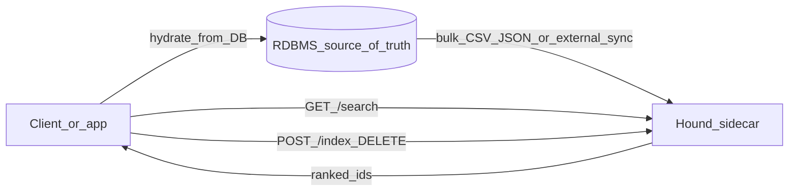
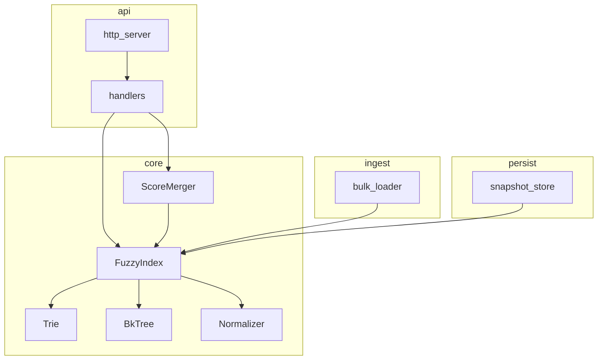

# Hound — design plan

Lightweight C++ sidecar for **fuzzy autocomplete + external-score merge**,
meant to run beside an RDBMS (source of truth). The core is domain-agnostic:
it only works with `{ id, text, external_score }`.

## Locked decisions

| Topic | Choice |
|-------|--------|
| Fuzzy | Trie (prefix) + BK-tree (Levenshtein) |
| API | HTTP JSON (cpp-httplib) |
| Persistence | In-memory + optional binary snapshot on boot (no WAL) |
| Text | ASCII + lowercasing (Unicode/NFKC = later) |
| Build | CMake + C++20 |
| Tests | Catch2 |
| License | MIT |
| Binary / lib | `hound` / `libhound` |

## Vision



## Architecture



### Folder layout

```
hound/
├── CMakeLists.txt
├── LICENSE
├── README.md
├── docs/PLANO.md
├── include/hound/
├── src/{core,api,ingest,persist}/
├── tests/{unit,integration}/
├── benchmarks/
├── tools/
└── third_party/
```

**Rule:** `core/` must not depend on HTTP, wire JSON, or CSV — only generic types.

### Data model and scoring

- `Document`: `id`, `text`, `external_score`
- `final = alpha * text_relevance + (1 - alpha) * normalize(external_score)`
- Upsert by `id` keeps Trie and BK-tree coherent

### HTTP API

| Method | Path | Behavior |
|--------|------|----------|
| `POST` | `/index` | upsert |
| `POST` | `/index/bulk` | document array |
| `DELETE` | `/index/:id` | remove |
| `GET` | `/search?q=&limit=&alpha=` | ranked ids |
| `GET` | `/health` | liveness |

No auth in the MVP (trusted network).

## Phases

| Phase | Deliverable | Acceptance |
|-------|-------------|------------|
| 0 | CMake skeleton + Catch2 + LICENSE + README | `cmake --build` + smoke `ctest` |
| 1 | Normalizer + Trie | prefix / upsert / delete unit tests |
| 2 | BK-tree + FuzzyIndex | typos distance 1–2; coherent upsert |
| 3 | ScoreMerger | deterministic ordering |
| 4 | Bulk CSV/JSON | load N generic docs |
| 5 | HTTP API | ephemeral-port integration |
| 6 | Snapshot | reload after restart |
| 7 | Benchmarks | p50/p95/p99, Recall@k, ingest, RSS at 1k/5k/20k |

## Out of scope (MVP)

- Automatic MySQL/Postgres sync
- Auth, multi-tenant, sharding
- Advanced Unicode (stemming, synonyms)
- Replacing Elasticsearch/Typesense
- Any real business schema or data

## Success criteria

- Sidecar indexes generic docs and returns ids under typos
- Reproducible metrics at three index sizes
- Public README: build, run, bulk, search
- Core has no business-domain concepts

## Post-MVP refinement

See [REFINEMENT.md](REFINEMENT.md): measured baseline, learning map
(Sonic / Typesense / Xapian / SymSpell / CppCon), effort×gain prioritization,
and Phase-2 changelog.

## Tests and benchmarks

Operational how/when: [AGENTS.md](../AGENTS.md). Detail for tools:
[benchmarks/macro/README.md](../benchmarks/macro/README.md),
[benchmarks/profiling/README.md](../benchmarks/profiling/README.md).
Remote CI still deferred.
