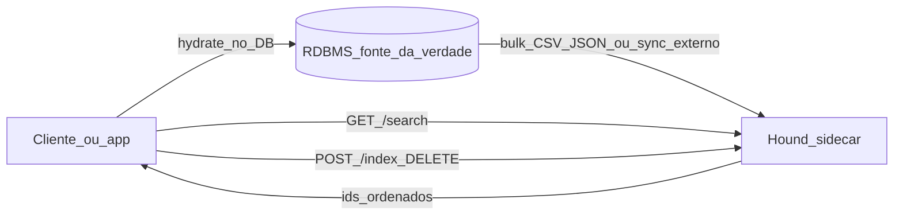
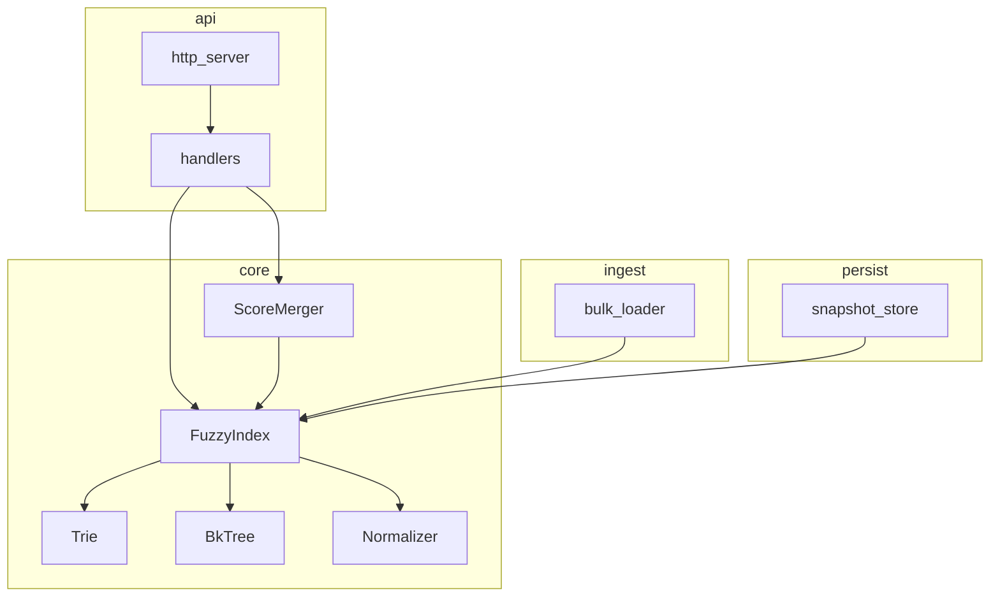

# Hound — plano de design

Sidecar C++ leve de **autocomplete fuzzy + merge de score externo**, pensado para rodar ao lado de um RDBMS (fonte da verdade). O núcleo é agnóstico de domínio: trabalha só com `{ id, texto, score_externo }`.

## Decisões travadas

| Tópico | Escolha |
|--------|---------|
| Fuzzy | Trie (prefixo) + BK-tree (Levenshtein) |
| API | HTTP JSON (cpp-httplib) |
| Persistência | Memória + snapshot binário opcional no boot (sem WAL) |
| Texto | ASCII + lowercasing (Unicode/NFKC = evolução) |
| Build | CMake + C++20 |
| Testes | Catch2 |
| Licença | MIT |
| Binário / lib | `hound` / `libhound` |

## Visão



## Arquitetura



### Estrutura de pastas

```
hound/
├── CMakeLists.txt
├── LICENSE
├── README.md
├── docs/PLANO.md
├── include/hound/
├── src/{core,api,ingest,persist}/
├── tests/{unit,integration}/
├── benchmarks/
├── tools/
└── third_party/
```

**Regra:** `core/` não depende de HTTP, JSON de wire nem CSV — só tipos genéricos.

### Modelo e scoring

- `Document`: `id`, `text`, `external_score`
- `final = alpha * text_relevance + (1 - alpha) * normalize(external_score)`
- Upsert por `id` mantém Trie e BK-tree coerentes

### API HTTP

| Método | Path | Comportamento |
|--------|------|---------------|
| `POST` | `/index` | upsert |
| `POST` | `/index/bulk` | array de documentos |
| `DELETE` | `/index/:id` | remove |
| `GET` | `/search?q=&limit=&alpha=` | ids ordenados |
| `GET` | `/health` | liveness |

Sem auth no MVP (rede confiável).

## Fases

| Fase | Entrega | Aceite |
|------|---------|--------|
| 0 | Skeleton CMake + Catch2 + LICENSE + README | `cmake --build` + `ctest` smoke |
| 1 | Normalizer + Trie | testes de prefixo / upsert / delete |
| 2 | BK-tree + FuzzyIndex | typos distância 1–2; upsert coerente |
| 3 | ScoreMerger | ordenação determinística |
| 4 | Bulk CSV/JSON | carregar N docs genéricos |
| 5 | API HTTP | integração em porta efêmera |
| 6 | Snapshot | reload após restart |
| 7 | Benchmarks | p50/p95/p99, Recall@k, ingestão, RSS em 1k/5k/20k |

## Fora de escopo (MVP)

- Sync automático com MySQL/Postgres
- Auth, multi-tenant, sharding
- Stemming / sinônimos / Unicode avançado
- Substituição de Elasticsearch/Typesense
- Qualquer schema ou dado de negócio real

## Critérios de sucesso

- Sidecar indexa docs genéricos e devolve ids sob typo
- Métricas reproduzíveis nos três tamanhos de índice
- README público com build, run, bulk e search
- Núcleo sem menção a domínio de negócio
